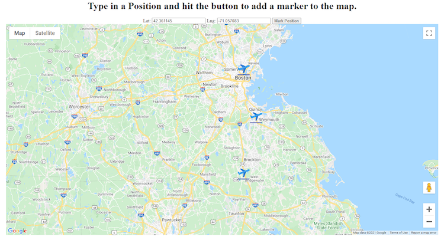

# Project Proposal

## Team

For the duration of this project our team members are:

- Trevor Stenson
- Tanner Muro

## Project Idea

For this project, we wanted to create something that involved 
aerospace since we are both massive aviation nerds. ICAO codes are 
international airport identifiers that are used to globally identify 
airports uniquely and are created by the International Civil Aviation 
Organization. The finished application we are proposing is one that 
serves as both a game and a learning system for users to learn about 
what ICAO/IATA codes reference what airports. The game component of 
the application would allow for users to guess what the ICAO code is 
for an airport given a photograph of the airport from either a region 
around the user's current location, or a randomly chosen airport from 
anywhere in the country. For each "round" of a game, a user is 
presented with an image that is programmatically generated through 
the google maps API of some portion of an airport, and provided 
with 2-4 ICAO codes as choices. The user can click and guess any of 
the options, and will find out if they were correct or not before 
moving on to the next round.  Each round can have different 
difficulty settings by varying the distance of the airport from 
the user.  Upon successfully guessing the ICAO code for an airport 
photo, a set of statistics about that airport will be displayed. 
Users will be able to compare their statistics with other users in 
both their local regions as well as with all users.

## Realtime Behavior

The realtime behavior for this application can be seen in a couple 
different ways. While a user is playing the game, websockets will be 
used to push updates to players regarding the outcome of a given 
round, as well as all new pertinent data for the next round after the 
current one is complete. There will also be a widget located on the 
site regardless of which page you're on that will display live 
updates globally to all users whenever someone gets a guess right.  
The scoreboard that will also be provided will be updating in 
realtime as people play the game and usurp positions on the board.

## Novelty

In our application we will make use of the Google Maps API to provide 
not only functionality for displaying the images of airports for 
people to base guesses off of, but also to provide a more 
personalized regional experience. We will make use of the web 
browser’s location in order to create a game consisting only of 
airports relatively close to the user’s region. This will allow 
people to test how well they know airports that they have most likely 
been to or around. This will also give us the option to provide 
regional scoreboards as well as a global one.

## Experiment 1: Map Locations and Marking

### Purpose

The purpose of this experiment was to assess the feasibility of using 
the Google Maps JavaScript API. Many of the features of our final 
application require using mapping data:

- Finding the user’s location in order to provide a regional 
  gameplay experience
- Using the latitude and longitude of a target airport to 
  programmatically find it on the map and display a top-down 
  aerial view of the airport
- Placing custom markers across a map to display successfully 
  guessed airports

Because of this, we needed to ensure the mapping API we used provided 
a robust set of features to implement this functionality.

Test 1: Basic Map

The first thing we tested was simply displaying a map on a webpage 
using the Google Maps JavaScript API. The implementation of this was 
relatively straightforward, only requiring an API key and function 
callback to be specified in the initial API call. The results of 
this can be seen in the basic.html file in the gmaps-experimentation 
folder:

The outcome of this experiment was successful, and we learned that 
there are plenty of parameters that we can use to do more complex 
things to manipulate the map. When implementing the actual 
application, we will need to disable identifying labels that could 
possibly give away the answer for airports.

Test 2: Locating the User

The next thing we tested in relation to mapping was accessing the 
location of the user. This is especially important to us so that we 
can offer a more regional experience based on the airports in the 
same general vicinity of the player. This can be seen in the 
geolocation.html file:

The results of this experiment were successful. When you load the 
page you initially see a map centered on downtown Boston. 
When clicking the “locate me” button, the browser attempts to access 
the browser’s location, add a marker on the map on that location, and 
center the viewport around it. This functionality works as expected, 
with a couple of caveats. This only works if the user gives browser 
permission to share their location with the application. In order to 
combat this, we will only offer the regional version of the game if 
e are given permission to access a user’s browser location. One other 
limitation we saw with this feature is that sometimes the location 
given by the browser is not completely accurate. This may be down to 
network configuration or device location accuracy settings, but most 
of the time the difference is not large enough to cause an issue.

Test 3: Placing Markers Programmatically

The third test we wanted to do was see how easy it would be to 
programmatically place markers on a map. This is important because 
it will provide us a way to nicely display statistics for a user in 
regards to what airports they have guessed correctly or incorrectly. 
It will provide a nice way to visualize which airports users know or 
don’t know. Since this list of airports will be stored server-side, 
we need a way to iterate over this data and place markers on a user’s 
profile page. For this test we used a simple input mechanism for new 
latitude and longitude positions that would then be used to place a 
marker on the map once a button is clicked:

This test was successful and proves that we can easily place custom
markers around a map given a properly formatted latitude/longitude 
position. Markers can easily programmatically be added to the map at 
runtime. The main challenge with implementing this is ensuring that 
all locations are properly formatted latitude and longitude values. 
Because some data sources use N and W instead of positive or negative
numbers in order to indicate these values, we need to be sure to 
convert accordingly.

### Outcome

Overall, this mapping experiment was successful. We were unsure how
configurable the map output of the Google Maps API was, but were 
pleasantly surprised as it seems we will easily be able to configure 
it given the constrained information we want to display to players. 
We can find a user’s location, transform the map to display localized 
images of areas we want (close up aerial views of airports), and 
quickly populate a map with custom markers to help display user 
statistics.

The expected workflow for users in regards to mapping functionality 
is primarily during the gameplay. Firstly, we will only offer the 
regional version of the game if we are given permission to access the
user’s location. Without this information, there is no region to 
focus on and the game will just include all airports nationally. 
Each round of a game makes use of the map API to display an aerial 
view centered on an airport, as well as removing all identifying 
information in the sense of location labels. This is the only way 
users will be trying to get information to guess an answer, so we have
to make sure it is done properly. Outside of the gameplay, mapping 
will be used to highlight airports known and unknown to a user in 
their profile/statistics page.

## Experiment 2: Airport Location API

### Purpose

The purpose of this experiment was to verify that the API that we 
were going to use would be successful in providing the data we
required while accepting the inputs that we were capable of providing.

API 1:
The first API that we had intended to use advertised that it would 
provide airport information such as location, name, and IATA code.  
IATA is a three letter prefix that is local to the country only, 
however, in practice the IATA code is simply the ICAO without the 
country prefix.  As we are limiting airports to the US, we can simply 
prepend that IATA code with a “K” and have the ICAO code.  
However, when beginning to test this API, it became clear that the API
was not intended to list airports in an area around a provided but 
instead was meant to find one or two airports given specific search 
terms.  This is clearly meant to provide search results as someone is 
typing into a form, and was not suitable for the use case that we 
required.

API 2:
The search was then on for a second API that actually provided the 
airports within an area as we required.  After some searching, we 
found an API provided by Lufthansa that would provide us the 
functionality that we required, and were able to verify this based 
off of the test inputs and outputs that were provided.  We then went 
on to register an API key to be able to proceed forward with the proof
of concept.  However, one of the forms required us to list the URL at 
which the application would be running, for some reason, this form 
does not accept URLs with the TLD of .xyz, which is the TLD that both 
partners use for this project.  So unless we wanted to incur the cost 
of another domain name, we sought another API.

API 3:
Finally, after some extended looking, we were able to find an API 
provided by a company named Amadeus, that provides us with more than 
enough data for each airport, and provides us with the ability to get 
all airports within a variable radius from given coordinates, with an 
upward bound of 500 km, which is exactly what we need.

### Outcome

It was easy to generate the API key and secrets that we required to 
be able to use the API.  From that point, all that was required was 
to construct the functions that will request and manage the expiration
of the oauth token that is required to access the actual API endpoint.
In the proof of concept we used the session to store the token and the
expiry information, but in the actual final project we will need to 
use some sort of state agent to be able to have the same credentials 
across all possible users  The users do not need separate connections,
only the server needs to keep track of this data.  Using one of the 
partners apartments as the coordinates to use, this experiment lists 
the name, IATA, and distance of the airports within 100 km of the 
given location.  This experiment shows that we can properly manage 
a token and use it to access the required API, and additionally 
demonstrates that that API provides us the information we require,
plus some, in order to properly operate our game as we intend.

All of the code can be found in the page_controller of air_codes_poc.

For users that do not allow location access, we can generate a 
random coordinate within the bounds of CONUS 
(Continental United States) and choose randomly from within a large 
radius.  This will allow all of our users to be able to play, not
just those who are willing to share their location with us.  This 
is also a method by which one can increase the difficulty of the 
game, especially useful for GA (General Aviation) who may be very 
familiar with the airfields surrounding their normal operations area.

## Database State

Besides user information, we will be persisting statistics regarding 
both the users guess and guesses about that particular airport.  
This allows us to have various leaderboards, such as who has the 
best correct/guess ratio, who is the best guesser in your state, etc.
As for the airport statistics, we can include the average distance 
from users, and what percentage of users are able to accurately 
identify the image from the aerial view.  We would be able to use 
this data to create a challenge set of those airports that people 
find the most difficult to identify from the air.  
